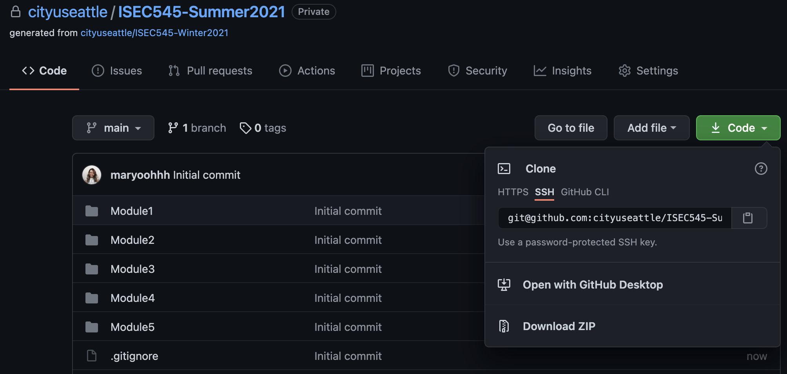

# ISEC545 Data Privacy and Security - Winter 2021

### PREPARATION TO DO PROGRAMMING EXERCISE

1. In your local machine, open Terminal (for Mac) or Command Propmt (for Windows), type the following commands to create a directory for this class:
* `cd Desktop` (to change directory to Desktop or to whichever directory you prefer)
* `mkdir ISEC545`(to create a directory for this course)
* `cd ISEC545` (to change directory to CS487 folder you just created)
* `git clone [URL]` (to download this Github repository to your local machine, **replace <URL> with the actual url of your repository**, example below

* `cd [repo_name]`(to change directory to the repository you just downloaded, **note that you need to replace with the actual repository name you just downloaded**

2. Change directory to the corresponding folder of each week. For example: Your work for module 1 should be stored under `Module1` folder; your work for module 2 should be stored under `Module2`, and so on

3. Now, follow the instructions provided in each folder to complete your Hands-on Practice

### SUBMIT YOUR WORK

Once you completed the Hands-on practice, do the following to push your work to GitHub

1. Open the terminal from the VSCode by hitting the control + ` key, make sure you are in the right path, for example:
dev/ISEC545/ISEC545-PE01-maryoohhh/Module1

Type the following command:
* `git add [filename]` or `git add .` (to add all files)
* `git commit -m 'Submission for Module 1'` (To add a message to your submission)
* `git push origin main` (to upload your work to Github)

### Additional Git features

Checking any changes and which branch you're in
* `git status` 

**Fetch** - retrieves any commits, references, branches, and files from a remote repository

**Prune** - cleans up local references to remote branch and prunes all deleted remote branch

**Pull** - used to fetch and download content from a remote repository and immediately update local repository to match that content

* `git fetch --prune --all`    
* `git pull`

Adding branch
* `git checkout -b [branch_name]`

Adding collaborators
* Settings
* Manage Access
* Invite a collaborator
* Search using username, full name, or email and select
* Add
